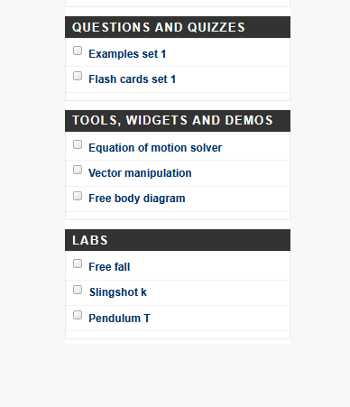

# Free fall 

This is a simple example project of a free falling object. 
The full description of the project can be found at http://physics.ammarica.com. 
Scroll down till you get to labs, and click on Free fall.  

## Description
What is in this folder are:
1 - The code the is used to extract frames from the mpeg4 to single frames.  
2 - Additional code if you want to blur part of these images. For example if you do not to show a person dropping the ball.  
3 - And excel sheet student can use to populate their data and get a graph for distance vs the t2.    

If you have any questions, suggestions or corrections, please drop me a line ammarica72@hotmail.com
